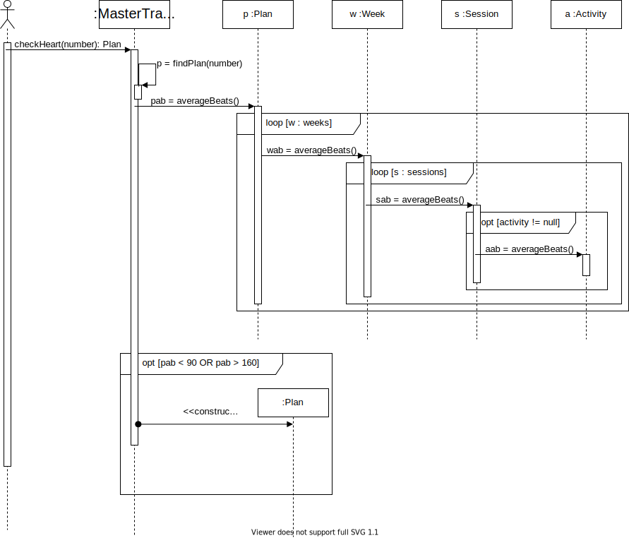

# POOB-TEST-FIRST-MASTER-TRAINING

La Sabana va a ofrecer un programa de entrenamiento de ciclismo a sus estudiantes dirigido por un deportólogo experto y un grupo
de entrenadores. Para gestionar este programa se desea implementar un sistema que permita 

1. **Definir rutinas de entrenamiento:** El deportólogo es el responsable de definir las rutinas necesarias para los entrenamientos.
2. **Crear planes de entrenamiento:** Los entrenadores se encargan de crear los planes de entrenamiento. Los planes están divididos en semanas y cada semana tiene un conjunto de sesiones de trabajo.
3. **Registrar las actividades asociadas a un plan de entrenamiento:** Cada ciclista debe registrar las actividades que realiza. Cada actividad corresponde a la ejecución de
una sesión de trabajo planteada.
4. **Evaluar el progreso de los ciclistas:** Los entrenadores y los ciclistas pueden evaluar el progreso de los planes de trabajo definidos.

## I. (25%) MEMORIA

Presente el mapa de memoria correspondiente a:
* Nairo Quintana nacido en 4 de Febrero de 1990, ha realizado 2 planes de entrenamiento con MasterTraining, el primer plan comenzó el 1 de Enero del 2017 y terminó el 1 de Febrero de 2017, el segundo plan comenzó el 19 de Febrero de 2018 y aún no termina, aunque solo tendrá una duración de 2 semanas, con 2 sesiones por semanas, los días 2 y 4 de la semana que corresponden a los días Martes y Jueves. Para los dos planes Lance Amstrong ha sido su entrenador.
* Nairo ha realizado 2 actividades del segundo plan. La primera el martes 20 de Febrero, con duración de 50 minutos, completó una distancia de 100Km. La segunda el Jueves 22 de Febrero, con duración de 3 horas, completó una distancia de 180Km.

## II. (35%) CÓDIGO

Implemente ÚNICAMENTE LO DISEÑADO para el método diseñado.

* Estudie el diagrama de secuencia, las especificaciones de los métodos y la documentación del API Java.
* Actualice el diagrama de clases considerando el diseño presentado. Agregue todos los métodos que hagan falta.
* Escriba el código correspondiente al encabezado y atributos de la clase responsable inicial. No olvide documentar el invariante.
* Implemente cada uno de los métodos correspondientes a la solución. No olvide documentar cada uno de los métodos involucrados.

## III. (20%) Diseño

Diseñe el constructor de la clase Plan que recibe como atributos el tipo de plan y el ciclista. Si el tipo de plan asignado es “Heart Care”, deberá crear un plan de 4 semanas de 1 hora de duración, con sesiones para los días Lunes, Miércoles y Viernes. El plan deberá quedar asignado al último entrenador con el cuál el ciclista entreno dada su actividad.

## IV. (20%) Conceptos

* ¿Qué es la sobrecarga de métodos?, ¿Cuándo es útil o apropiado realizar una sobrecarga de un método y cuáles son sus beneficios?
* ¿Cuáles son las 5 etapas del proceso de desarrollo de software vistas en clase? ¿Cuál es el propósito de cada una de ellas?

## V. (20%) Bono 

* A partir de su diseño del constructor de la clase Plan presentado en la sección III, implmente el código y agregue las pruebas necesarias.

## Condiciones

1. Puede encontrar los editables de los diagramas en este [enlace](https://unisabanaedu-my.sharepoint.com/:u:/g/personal/diegopt_unisabana_edu_co/EdgAK6j8YitMkmasnEGxdeEBeyKGvnm81n-qE1sqgD_g7Q?e=kc9Hwe).
2. Puede acceder a todos los recursos que considere necesarios, excepto pedirle ayuda a un tercero.
3. El examen se calificará contra un conjunto de pruebas que no esta adjunto al parcial, sin embargo el mismo cuenta con un conjunto de pruebas modelo, piense en casos que pueden no estar cubiertos en el mismo.

 
